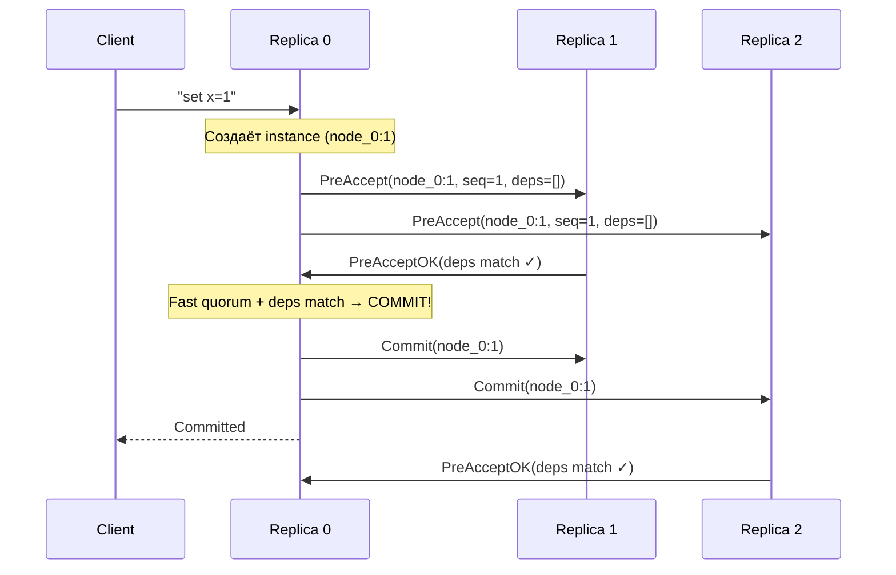
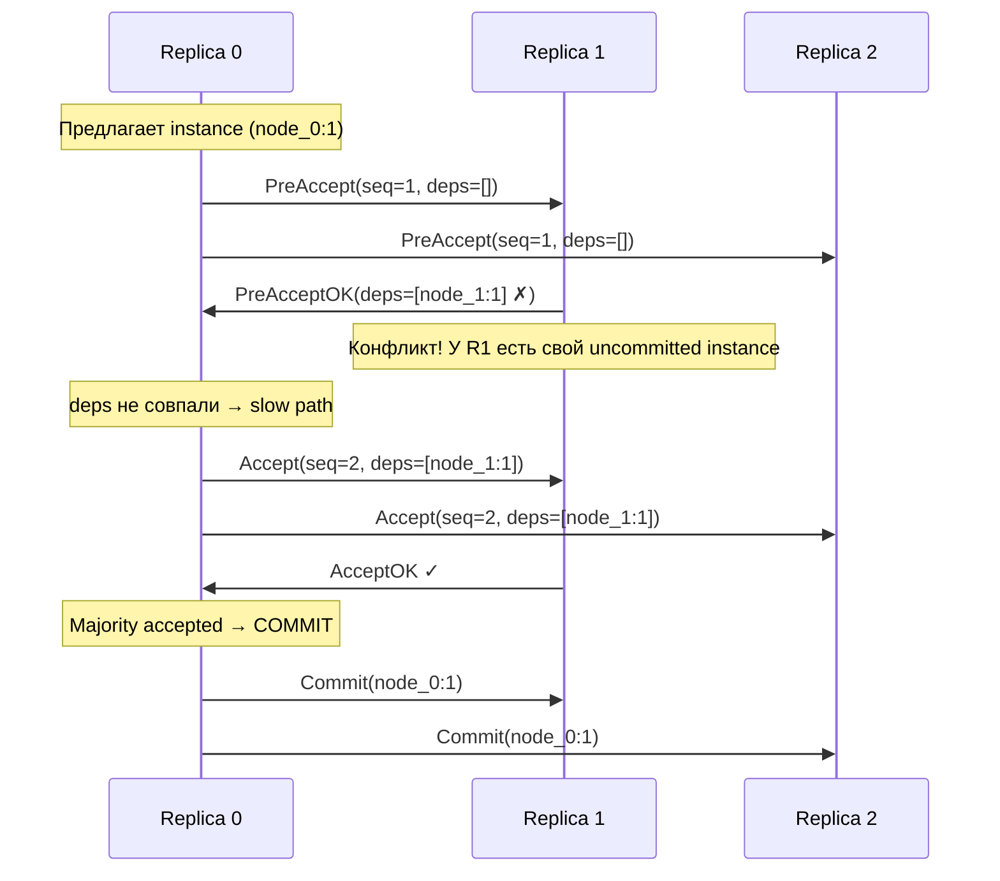

# EPaxos (Egalitarian Paxos)

## Обзор

EPaxos — leaderless-алгоритм консенсуса, разработанный Moraru, Andersen и Kaminsky в 2013 году. Главная идея: **любой узел может предложить команду**, и в отсутствие конфликтов коммит происходит за **один round-trip** (fast path). При конфликтах используется явное разрешение зависимостей (slow path, 2 RTT).

**Ключевые особенности:**
- Нет лидера — все узлы равноправные реплики
- Оптимальная латентность: 1 RTT в большинстве случаев (fast path)
- Зависимости между конкурентными командами отслеживаются явно
- Нет single point of contention (в отличие от Raft/Multi-Paxos)

## Роли узлов

| Роль | Цвет в симуляторе | Метка | Поведение |
|------|-------------------|-------|-----------|
| **Replica** | 🔵 синий | R | Все узлы равны; каждый может предлагать и принимать команды |

В отличие от всех остальных алгоритмов в симуляторе, EPaxos **не имеет лидера**. Любой узел может принять клиентский запрос и начать процесс коммита.

## Instances (экземпляры)

Каждое предложение создаёт **instance** — уникальный экземпляр консенсуса, идентифицируемый парой `(replicaId, instanceNumber)`:

```
instanceKey = "node_2:5"  →  5-я команда, предложенная node_2
```

Каждый instance отслеживает:
- `command` — предложенная команда
- `seq` — порядковый номер (для упорядочивания)
- `deps` — список зависимостей (instance keys конфликтующих команд)
- `status` — `pre-accepted` → `accepted` → `committed`

## Fast Path (1 RTT) — без конфликтов

Когда нет конфликтов (все реплики согласны по зависимостям):



### Fast quorum

Для fast path требуется **fast quorum** — `⌊N/2⌋ + 1` узлов (включая предлагающую реплику).

| Кластер (N) | Fast quorum | Обычный majority |
|-------------|-------------|-----------------|
| 3 | 2 | 2 |
| 5 | 3 | 3 |
| 7 | 4 | 4 |

## Slow Path (2 RTT) — при конфликтах

Когда реплики не согласны по зависимостям (конфликт):



### Что считается конфликтом

В симуляции используется упрощённое определение конфликта: **любой uncommitted instance от другой реплики** считается конфликтом. В оригинальном EPaxos конфликт определяется пересечением ключей (key sets) команд.

## Визуальные отличия в симуляторе

| Элемент | Форма | Цвет |
|---------|-------|------|
| PreAccept (fast path) | 🔺 треугольник | зелёный |
| Accept (slow path) | 🔷 ромб | фиолетовый |
| Commit | 🟢 круг | зелёный |

На замедленной скорости хорошо видно:
- **Без конфликтов**: треугольники летят от реплики к остальным → обратно → кружки коммита
- **С конфликтами**: после треугольников появляются фиолетовые ромбы Accept → затем кружки коммита

## Сравнение латентности

```
Basic Paxos:  Prepare → Promise → Accept → Accepted = 2 RTT (всегда)
Multi-Paxos:  Accept → Accepted = 1 RTT (после выборов)
Raft:         AppendEntries → Response = 1 RTT (через лидера)
EPaxos:       PreAccept → PreAcceptOK = 1 RTT (fast path, без лидера!)
              + Accept → AcceptOK     = 2 RTT (slow path, при конфликтах)
```

## Обработка отказов

### Отключение реплики

Остальные реплики продолжают работать — нет лидера, нечему «упасть». Клиент просто переключается на другую реплику. Потерянная реплика не блокирует прогресс, пока есть кворум.

### Восстановление

При восстановлении узел получает `Commit` сообщения с пропущенными committed записями от лучшего живого peer-а.

## Отклонения от оригинального алгоритма

| Аспект | Оригинал (Moraru et al.) | Симуляция |
|--------|-------------------------|-----------|
| Определение конфликта | Пересечение key sets команд | Любой uncommitted instance от другой реплики |
| Execution ordering | Tarjan's SCC для графа зависимостей | Не реализовано; порядок по времени получения |
| Explicit Prepare | Восстановление через explicit prepare | Не реализовано |
| Thrifty optimization | Отправка только fast quorum реплик | Отправка всем репликам |
| Pipelining | Несколько instances параллельно | Один active instance за раз на реплику |
| Persistent state | Instance state на диске | Только в памяти |

## Источники

1. **Moraru I., Andersen D., Kaminsky M.** "There is more consensus in Egalitarian Parliaments" (2013) — [ACM SOSP](https://www.cs.cmu.edu/~dga/papers/epaxos-sosp2013.pdf)
2. **Moraru I., Andersen D., Kaminsky M.** "A Proof of Correctness for Egalitarian Paxos" (2013) — [CMU Technical Report](https://www.cs.cmu.edu/~dga/papers/epaxos-tr.pdf)

::: tip Попробуйте в симуляторе
Откройте [симулятор](/consensus-landscape/), поставьте рядом EPaxos и Raft. Отправьте команду в каждый — EPaxos закоммитит за 1 RTT без лидера, Raft потребует 1 RTT но через единственного лидера. Отключите узел в EPaxos — остальные продолжат работать без перевыборов.
:::
