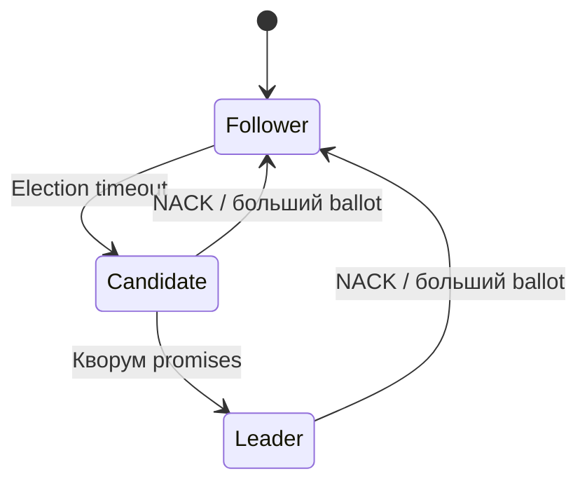
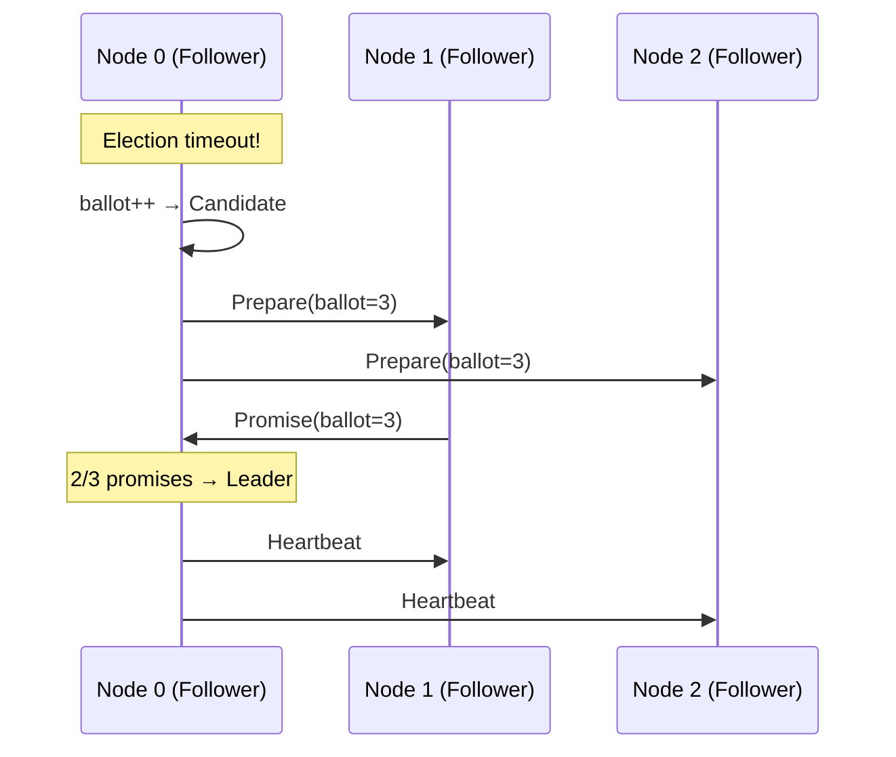
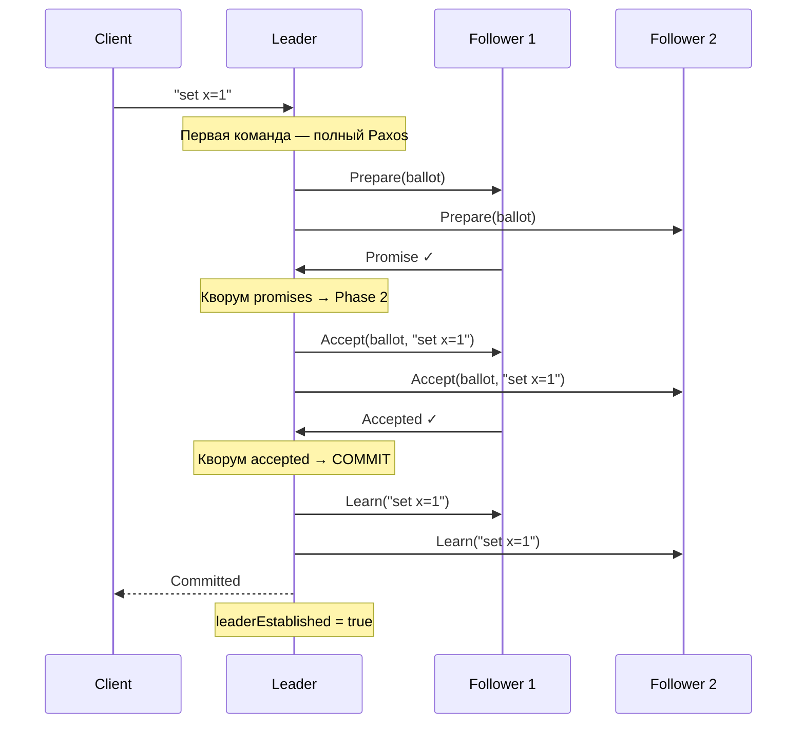
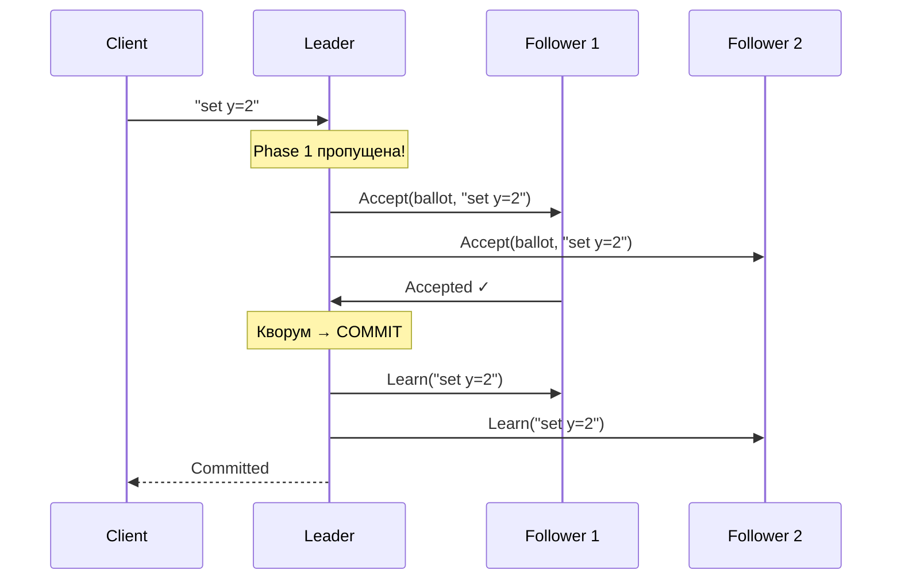

# Multi-Paxos

## Обзор

Multi-Paxos — оптимизация Basic Paxos, предложенная Leslie Lamport. Ключевая идея: после выбора лидера через Prepare/Promise (фаза 1) все последующие команды могут пропускать фазу 1 и сразу отправляться через Accept/Accepted. Это сокращает steady-state латентность с 2 RTT до 1 RTT.

**Ключевые особенности:**
- Стабильный лидер — после выборов обрабатывает команды без повторного Prepare
- Первая команда после (пере)выборов идёт полным путём (2 RTT), остальные — быстрым (1 RTT)
- Heartbeats для поддержания лидерства
- При потере лидера — полный цикл Paxos заново

## Роли узлов



| Роль | Цвет в симуляторе | Поведение |
|------|-------------------|-----------|
| **Follower** | 🔵 синий | Принимает Accept, отвечает Accepted; сбрасывает election timer по heartbeat |
| **Candidate** | 🟡 жёлтый | Отправляет Prepare, собирает Promise |
| **Leader** | 🟢 зелёный | Отправляет Accept напрямую (пропуская Prepare); рассылает heartbeats |

## Нумерация Ballot

Как и в Basic Paxos, ballot numbers глобально уникальны:

```
ballotNumber = seqNum × nodeCount + nodeIndex
```

## Выборы лидера (Phase 1)

Выборы используют стандартный механизм Paxos: Prepare → Promise.



## Первая команда: полный Paxos (2 RTT)

После избрания лидер ещё не «установлен» — первая команда проходит через обе фазы для подтверждения лидерства:



## Последующие команды: оптимизированный путь (1 RTT)

Лидер пропускает Phase 1 и отправляет Accept напрямую:



## Heartbeats

Лидер периодически рассылает heartbeats для:
1. Подтверждения лидерства (предотвращает ненужные выборы)
2. Сброса election timer у follower-ов

| Параметр | LAN | WAN | Global |
|----------|-----|-----|--------|
| Election timeout | 50–100 мс | 300–600 мс | 1000–2000 мс |
| Heartbeat interval | 20 мс | 100 мс | 300 мс |

## Обработка отказов

### Потеря лидера

1. Heartbeats прекращаются → election timer срабатывает у follower-а
2. Follower становится candidate → отправляет Prepare
3. Получает кворум Promise → становится новым лидером
4. Первая команда снова идёт полным путём (2 RTT)
5. После первого коммита — переход на быстрый путь (1 RTT)

### NACK и step-down

Если acceptor получает Accept или Prepare с ballot ниже своего `minProposal`, он отвечает NACK. Лидер, получивший NACK, уступает лидерство:
- Становится follower
- Пересчитывает seqNum, чтобы следующий ballot был выше
- Ждёт backoff перед повторной попыткой

## Отклонения от оригинального алгоритма

| Аспект | Оригинал (Lamport) | Симуляция |
|--------|-------------------|-----------|
| Multi-decree | Leader устанавливается одним Prepare для всех слотов | Первая команда повторяет Prepare для наглядности |
| Слоты | Каждое значение привязано к номеру слота | Команды добавляются последовательно в лог |
| Персистентность | ballot, accepted value на диске | Только в памяти |
| Pipelining | Несколько Accept параллельно | Одна команда за раз |
| Learner | Выделенная роль | Нет; лидер рассылает Learn |

## Источники

1. **Lamport L.** "The Part-Time Parliament" (1998) — [ACM TOCS](https://lamport.azurewebsites.net/pubs/lamport-paxos.pdf)
2. **Lamport L.** "Paxos Made Simple" (2001) — [Microsoft Research](https://lamport.azurewebsites.net/pubs/paxos-simple.pdf)
3. **Van Renesse R., Altinbuken D.** "Paxos Made Moderately Complex" (2015) — [ACM Computing Surveys](https://doi.org/10.1145/2673577)

::: tip Попробуйте в симуляторе
Откройте [симулятор](https://khorost.github.io/consensus-landscape/), поставьте рядом Multi-Paxos и Basic Paxos. Обратите внимание: после выборов первая команда в Multi-Paxos идёт через Prepare→Accept (2 RTT), а вторая — только через Accept (1 RTT). В Basic Paxos каждая команда всегда проходит оба этапа.
:::
