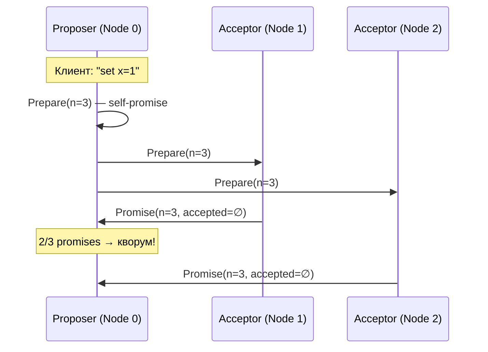
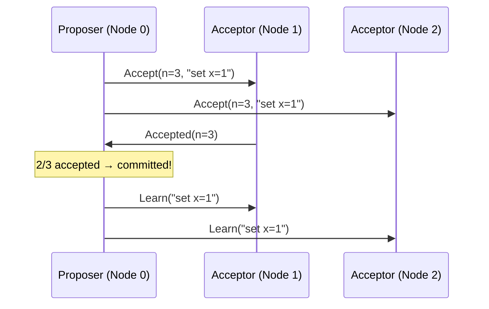
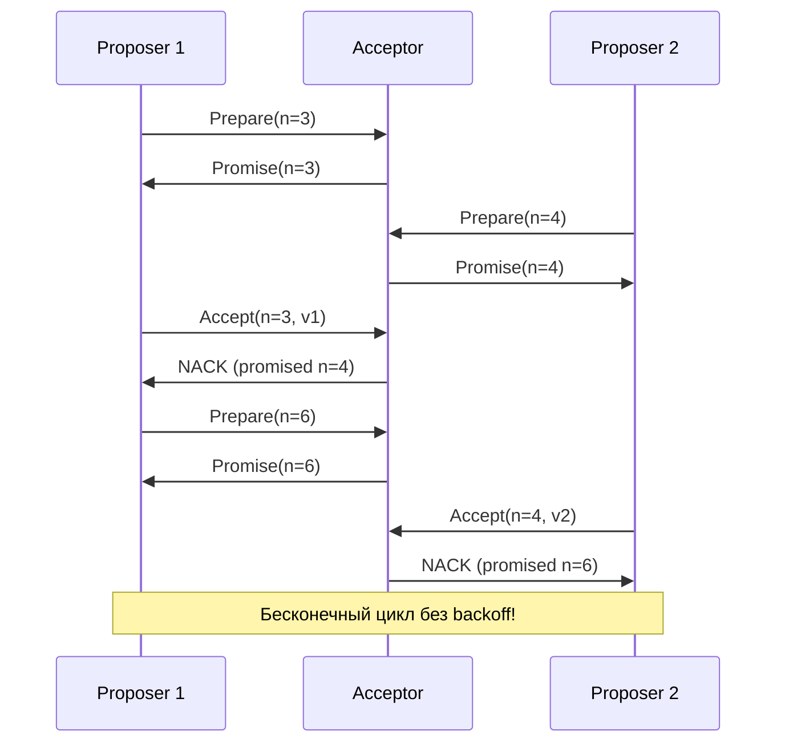
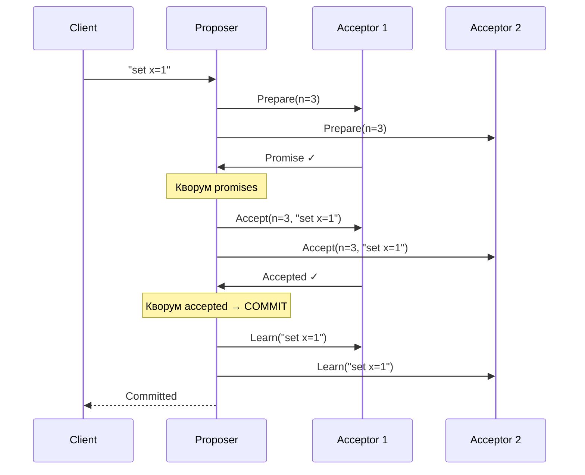

# Basic Paxos


## Обзор

Paxos — алгоритм консенсуса, придуманный Leslie Lamport в 1989 году и опубликованный в 1998 году в статье "The Part-Time Parliament". Это исторически **первый корректно доказанный** алгоритм распределённого консенсуса.

**Ключевые особенности:**
- Нет выделенного лидера — любой узел может предложить значение
- Двухфазный протокол: Prepare/Promise → Accept/Accepted
- Гарантирует согласие при наличии кворума, но не гарантирует прогресс (livelock при «дуэли» proposer-ов)

## Роли узлов

В Classic Paxos каждый узел совмещает роли **proposer** и **acceptor**:

| Роль | Цвет в симуляторе | Поведение |
|------|-------------------|-----------|
| **Acceptor** | 🔵 синий | Отвечает на Prepare/Accept; пассивное состояние |
| **Proposer** | 🟡 жёлтый | Активно предлагает значение; проводит раунд консенсуса |

Узел становится proposer при получении клиентского запроса и возвращается в acceptor после коммита.

## Нумерация предложений

Для глобальной уникальности номера предложений генерируются по формуле:

```
proposalNumber = seqNum × nodeCount + nodeIndex
```

Например, при 3 узлах: node_0 использует номера 3, 6, 9…; node_1 — 4, 7, 10…; node_2 — 5, 8, 11…

## Фаза 1: Prepare / Promise

Proposer рассылает `Prepare(n)` всем acceptor-ам. Каждый acceptor:
- Если `n > minProposal` → обещает не принимать предложения с номером ниже `n`, отвечает `Promise` с ранее принятым значением (если есть)
- Если `n ≤ minProposal` → отвечает `NACK`



## Фаза 2: Accept / Accepted

Получив кворум Promise, proposer рассылает `Accept(n, value)`:
- Если какой-то acceptor сообщил ранее принятое значение — proposer **обязан** использовать его (правило Paxos)
- Иначе предлагает своё значение



## Фаза Learn

После получения кворума Accepted, proposer:
1. Добавляет значение в свой лог как committed
2. Рассылает `Learn` всем узлам, чтобы они обновили свои логи

## Dueling Proposers

Если два узла одновременно начинают Prepare с разными номерами, они могут блокировать друг друга — каждый NACK-ает другого:



### Решение в симуляции: неравномерный backoff

Чтобы разорвать симметрию, таймаут отступа зависит от индекса узла:

```
backoff = BASE + nodeIndex × PER_NODE + random(0, JITTER)
```

Узлы с меньшим индексом возвращаются раньше, что даёт им преимущество. Значения по умолчанию:
- `BASE = 200 мс`, `PER_NODE = 120 мс`, `JITTER = 100 мс`

Аналогичная формула используется для таймаута в Prepare-фазе:
- `BASE = 200 мс`, `PER_NODE = 80 мс`, `JITTER = 150 мс`

## Восстановление узла

При восстановлении отключённого узла движок находит лучшего живого peer-а и отправляет `Learn` для всех пропущенных committed записей. Это реализует **state transfer** — упрощённый аналог snapshot/catch-up.

## Полный цикл коммита



## Отклонения от оригинального алгоритма

| Аспект | Оригинал (Lamport) | Симуляция |
|--------|-------------------|-----------|
| Модель | Single-decree Paxos (одно значение) | Повторяется для каждой команды последовательно |
| Multi-Paxos | Стабильный лидер после первого Prepare | Не реализован; каждая команда — полный 2-фазный цикл |
| Learner | Выделенная роль learner | Нет; proposer рассылает Learn всем |
| Персистентность | `minProposal`, `acceptedProposal`, `acceptedValue` на диске | Только в памяти |
| Порядок в логе | Определяется номером слота | Каждый узел добавляет записи в порядке получения Learn; порядок может различаться |
| Acceptor state | Хранится между раундами | Сбрасывается после коммита (каждый коммит — новый экземпляр Paxos) |
| PRNG | Не специфицирован | `Math.random()` в backoff вместо seeded RNG |

## Источники

1. **Lamport L.** "The Part-Time Parliament" (1998) — [ACM TOCS](https://lamport.azurewebsites.net/pubs/lamport-paxos.pdf)
2. **Lamport L.** "Paxos Made Simple" (2001) — [Microsoft Research](https://lamport.azurewebsites.net/pubs/paxos-simple.pdf)
3. **Van Renesse R., Altinbuken D.** "Paxos Made Moderately Complex" (2015) — [ACM Computing Surveys](https://doi.org/10.1145/2673577)

::: tip Попробуйте в симуляторе
Откройте [симулятор](https://khorost.github.io/consensus-landscape/), выберите Paxos, добавьте вторую панель с Raft и сравните количество сообщений для одной операции записи.
:::
