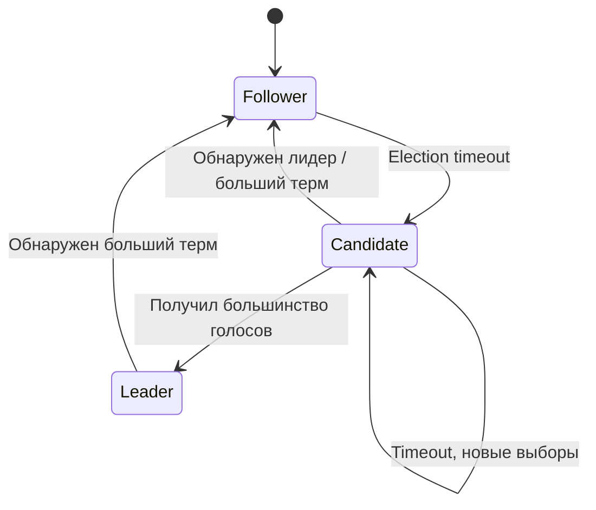
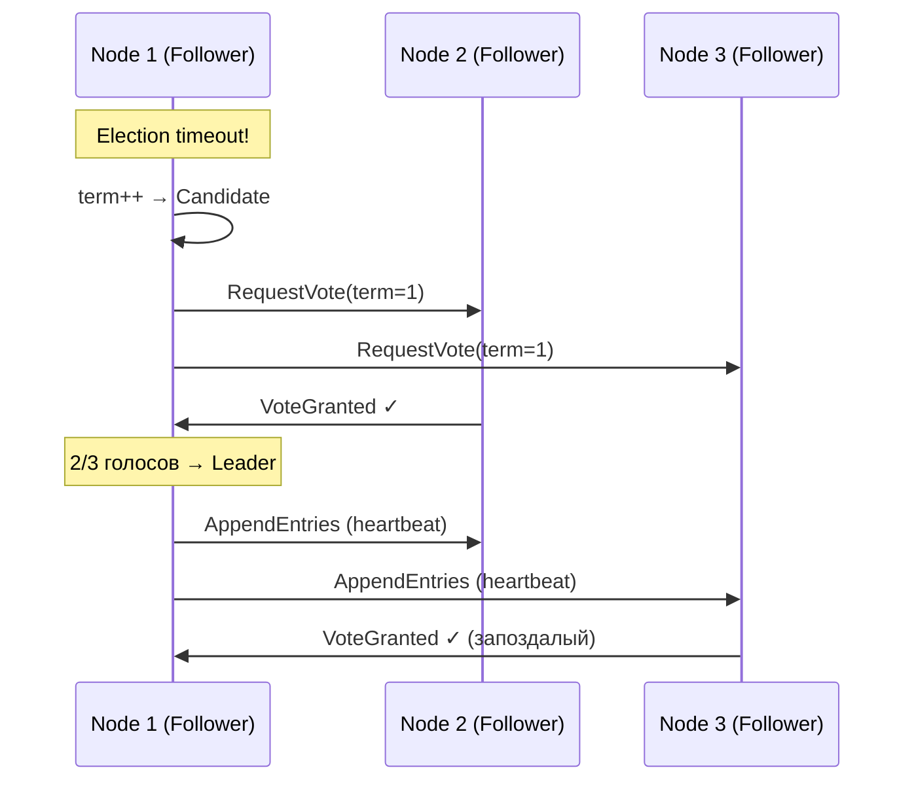
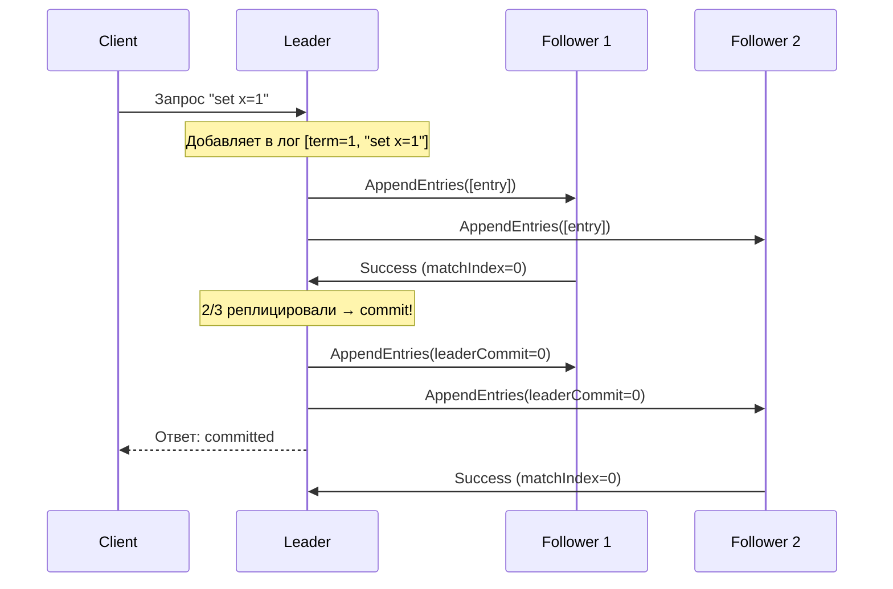

# Raft


## Обзор

Raft — алгоритм консенсуса, разработанный Diego Ongaro и John Ousterhout в 2014 году с целью быть **понятнее Paxos** при сохранении тех же гарантий. Raft декомпозирует консенсус на три относительно независимые подзадачи: выборы лидера, репликация лога и безопасность.

**Ключевые особенности:**
- Сильный лидер — все записи идут через единственного лидера
- Термы (terms) — логические эпохи, монотонно возрастающие
- Рандомизированные таймауты для разрешения конфликтов при выборах

## Роли узлов



| Роль | Цвет в симуляторе | Поведение |
|------|-------------------|-----------|
| **Follower** | 🔵 синий | Принимает записи от лидера, голосует в выборах |
| **Candidate** | 🟡 жёлтый | Запрашивает голоса, пытается стать лидером |
| **Leader** | 🟢 зелёный | Принимает запросы клиентов, реплицирует лог |

## Выборы лидера

Когда follower не получает heartbeat от лидера в течение `electionTimeout`, он становится candidate и начинает выборы.

### Sequence-диаграмма: успешные выборы



### Параметры в симуляции

| Параметр | LAN | WAN | Global |
|----------|-----|-----|--------|
| Election timeout | 50–100 мс | 300–600 мс | 1000–2000 мс |
| Heartbeat interval | 20 мс | 100 мс | 300 мс |

Таймаут рандомизируется в диапазоне `[min, max]` для каждого узла, чтобы минимизировать split vote — ситуацию, когда два candidate одновременно набирают голоса и ни один не получает большинства.

## Репликация лога

Лидер принимает команды от клиентов, добавляет их в свой лог и рассылает `AppendEntries` всем follower-ам.

### Sequence-диаграмма: репликация и коммит



### Продвижение commitIndex

Лидер увеличивает `commitIndex`, когда запись текущего терма реплицирована на **большинство** узлов:

```
Для каждого N > commitIndex (от конца лога к началу):
  Если log[N].term == currentTerm И
     count(matchIndex[peer] >= N) >= majority:
    commitIndex = N
```

## Heartbeats

Лидер периодически рассылает пустые `AppendEntries` (heartbeats), чтобы:
1. Подтвердить своё лидерство
2. Сбросить election timer у follower-ов
3. Передать актуальный `leaderCommit`

В симуляции heartbeat — это ромб (●), летящий от лидера к follower-ам.

## Обработка отказов

При отключении лидера follower-ы не получают heartbeat, срабатывает election timeout и начинаются новые выборы. В симуляции можно наблюдать:

1. Лидер отключён → heartbeat-ы прекращаются
2. Один из follower-ов первым «просыпается» → становится candidate
3. Собирает голоса → становится новым лидером
4. Возобновляет обработку клиентских запросов

## Отклонения от оригинального алгоритма

Симуляция реализует ядро Raft, но с некоторыми упрощениями:

| Аспект | Оригинал (Raft paper) | Симуляция |
|--------|----------------------|-----------|
| Персистентность | `currentTerm`, `votedFor`, `log` сохраняются на диск | Только в памяти; сбрасывается при перезагрузке |
| Log compaction | Snapshots для ограничения размера лога | Нет; старые записи обрезаются простым trim |
| Конфигурация кластера | Joint consensus для динамического изменения | Фиксированный размер кластера |
| Read-only запросы | Через readIndex или lease | Не реализованы |
| Heartbeats | Могут содержать записи лога (piggybacking) | Всегда пустые; репликация только по команде клиента |
| PRNG | Не специфицирован | `Math.random()` в таймаутах вместо seeded RNG |

## Источники

1. **Ongaro D., Ousterhout J.** "In Search of an Understandable Consensus Algorithm" (2014) — [USENIX ATC](https://raft.github.io/raft.pdf)
2. **Raft Visualization** — [raft.github.io](https://raft.github.io/)
3. **Ongaro D.** "Consensus: Bridging Theory and Practice" (PhD dissertation, 2014) — [Stanford](https://web.stanford.edu/~ouster/cgi-bin/papers/OngaroPhD.pdf)

::: tip Попробуйте в симуляторе
Откройте [симулятор](https://khorost.github.io/consensus-landscape/), выберите Raft, отключите лидер (клик на зелёный узел → «Отключить») и наблюдайте за перевыборами.
:::
