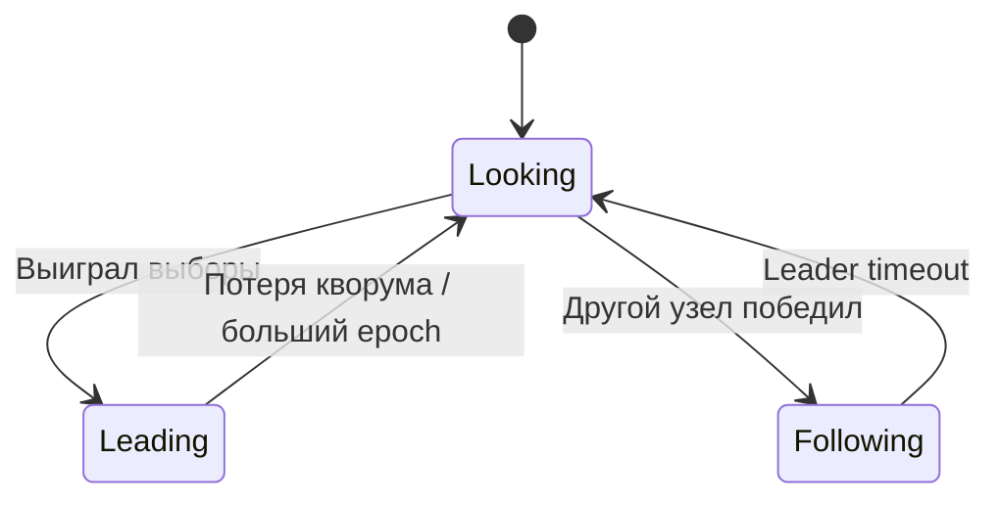
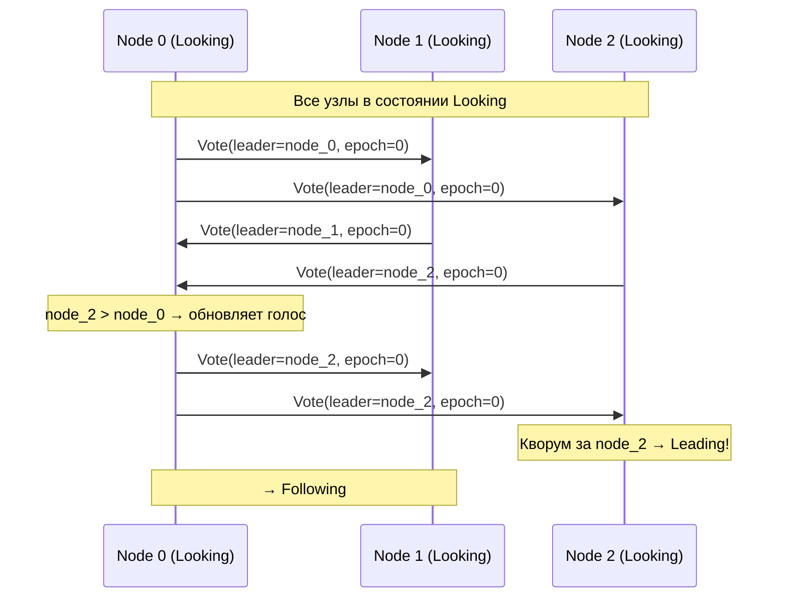
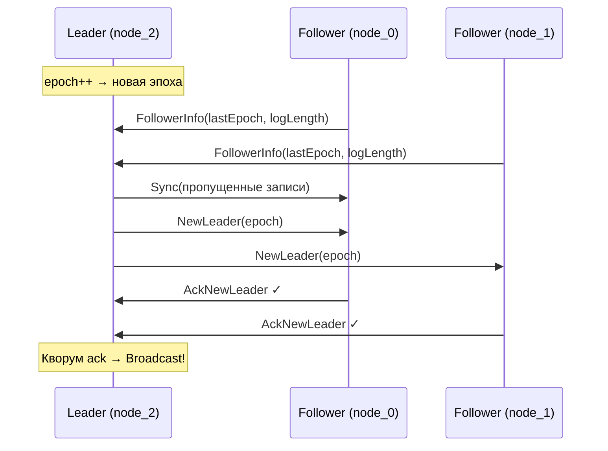
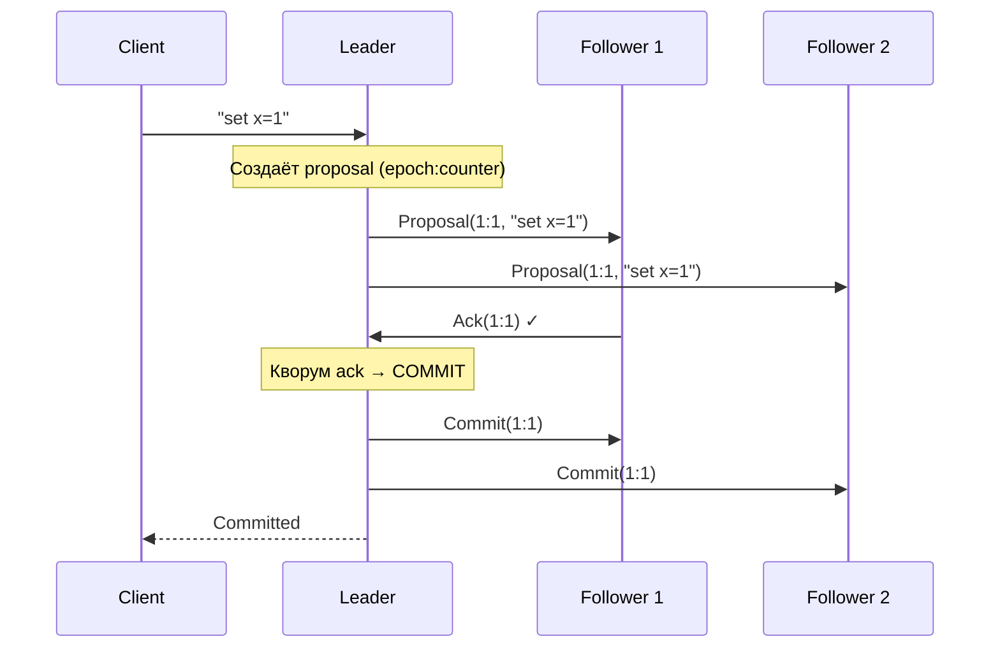

# Zab (ZooKeeper Atomic Broadcast)


## Обзор

Zab — протокол atomic broadcast, разработанный для Apache ZooKeeper (2011). Обеспечивает **total order broadcast** — все узлы видят сообщения в одинаковом порядке. Разработан независимо от Raft, но имеет похожую leader-based архитектуру.

**Ключевые особенности:**
- Три явные фазы: Election → Synchronization → Broadcast
- Epoch-based версионирование (аналог term в Raft)
- Гарантия FIFO-порядка при смене лидеров (causal order)
- Трёхшаговый коммит: Proposal → Ack → Commit

## Роли узлов



| Роль | Цвет в симуляторе | Метка | Поведение |
|------|-------------------|-------|-----------|
| **Looking** | 🟡 жёлтый | E | Участвует в выборах; голосует за лучшего кандидата |
| **Following** | 🔵 синий | ZF | Принимает proposals, отправляет ack; ожидает heartbeat |
| **Leading** | 🟢 зелёный | ZL | Принимает клиентские запросы, рассылает proposals |

## Фаза 1: Election (Выборы)

Каждый узел голосует за кандидата с **наивысшим zxid** (epoch, counter). При равенстве — побеждает узел с большим ID.



### Правило обновления голоса

Узел обновляет свой голос, если входящее предложение **лучше** текущего:

```
1. Больший epoch                         → обновить
2. Тот же epoch, больший counter          → обновить
3. Тот же epoch и counter, больший nodeId → обновить
```

## Фаза 2: Synchronization (Синхронизация)

Новый лидер приводит follower-ов в актуальное состояние перед началом обработки запросов:



Во время синхронизации:
- Follower-ы отправляют `FollowerInfo` с информацией о своём последнем состоянии
- Лидер отправляет `Sync` сообщения с пропущенными committed записями
- Лидер отправляет `NewLeader` с новым epoch
- После получения кворума `AckNewLeader` — переход к Broadcast

## Фаза 3: Broadcast (Обработка запросов)

Трёхшаговый коммит: Proposal → Ack → Commit.



### Отличие от Raft

В Raft коммит piggyback-ится в следующем AppendEntries/heartbeat. В Zab Commit — **явное отдельное сообщение**, что делает протокол трёхшаговым:

| Шаг | Zab | Raft |
|-----|-----|------|
| 1 | Proposal → Follower | AppendEntries → Follower |
| 2 | Ack → Leader | Response → Leader |
| 3 | **Commit → Follower** | _(piggybacked в следующем heartbeat)_ |

## Heartbeats

Лидер рассылает heartbeats для поддержания лидерства. При пропуске heartbeat follower переходит в Looking и начинает новые выборы.

## Обработка отказов

### Потеря лидера

1. Heartbeats прекращаются → follower-ы переходят в Looking
2. Начинаются новые выборы с учётом текущего epoch и counter
3. Новый лидер инкрементирует epoch
4. Синхронизация → Broadcast

### Восстановление узла

При восстановлении узел получает `Sync` сообщения с пропущенными committed записями от лучшего живого peer-а.

## Zxid: двумерная версия

Вместо одномерного term/ballot, Zab использует двумерный идентификатор транзакции:

```
zxid = (epoch, counter)
```

- **epoch** — инкрементируется при каждой смене лидера
- **counter** — инкрементируется для каждой транзакции внутри эпохи; сбрасывается при новом epoch

## Отклонения от оригинального алгоритма

| Аспект | Оригинал (ZooKeeper) | Симуляция |
|--------|---------------------|-----------|
| Fast Leader Election | Обмен notification-ами с retry | Broadcast голосов, кворумное решение |
| Discovery phase | Отдельная фаза discovery | Совмещена с election |
| Transaction log | WAL на диске с snapshot | Только в памяти |
| Quorum | Configurable (возможны weighted quorums) | Простое большинство |
| Learner (Observer) | Не голосующие read-only узлы | Не реализованы |
| FIFO guarantees | TCP гарантирует FIFO между парами | Симуляция не моделирует FIFO per-pair |

## Источники

1. **Junqueira F., Reed B., Serafini M.** "Zab: High-performance broadcast for primary-backup systems" (2011) — [IEEE DSN](https://doi.org/10.1109/DSN.2011.5958223)
2. **Reed B., Junqueira F.** "A simple totally ordered broadcast protocol" (2008) — [ACM LADIS](https://www.datadoghq.com/pdf/zab.totally-ordered-broadcast-protocol.2008.pdf)
3. **Hunt P., Konar M., Junqueira F., Reed B.** "ZooKeeper: Wait-free Coordination for Internet-scale Systems" (2010) — [USENIX ATC](https://www.usenix.org/legacy/event/atc10/tech/full_papers/Hunt.pdf)

::: tip Попробуйте в симуляторе
Откройте [симулятор](https://khorost.github.io/consensus-landscape/), поставьте рядом Zab и Raft. Отключите лидера и сравните: в Zab после выборов видна явная фаза синхронизации (Sync → NewLeader → AckNewLeader) перед началом обработки запросов, а в Raft лидер начинает работать сразу.
:::
