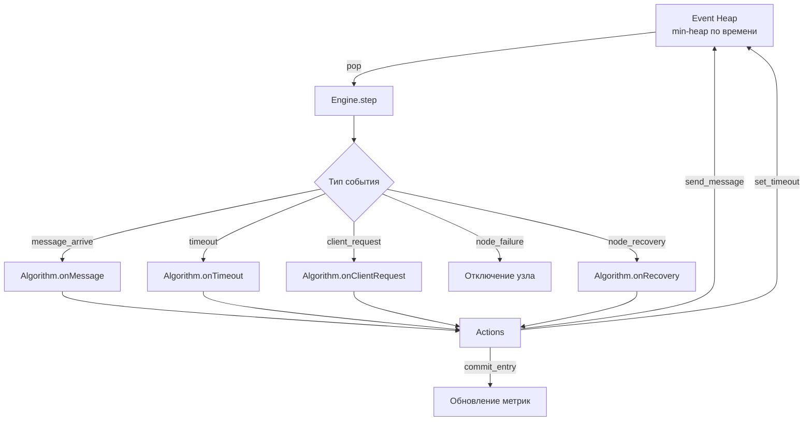

# Модель симуляции


## Архитектура

Симулятор использует **дискретно-событийную модель** (Discrete Event Simulation). Вместо непрерывного течения времени система переходит между дискретными событиями: доставка сообщения, срабатывание таймаута, запрос клиента, отказ узла.



### Компоненты

| Компонент | Файл | Назначение |
|-----------|------|------------|
| **Engine** | `engine.ts` | Очередь событий, виртуальные часы, диспетчер |
| **EventHeap** | `engine.ts` | Бинарная min-heap с ленивой отменой — O(log n) insert/pop |
| **NetworkModel** | `network.ts` | Задержки, потери пакетов, сетевые партиции |
| **ConsensusAlgorithm** | `algorithms/interface.ts` | Интерфейс, который реализуют Raft и Paxos |

## Виртуальное время

Симуляция работает в **виртуальном времени** (миллисекунды). Скорость виртуального времени относительно реального регулируется множителем (0.25x–10x).

Визуализация сэмплирует состояние через `requestAnimationFrame`: каждый кадр движок обрабатывает все события до `currentVirtualTime + deltaReal * speedMultiplier`.

## Сеть

### Модель задержек

Задержка доставки каждого сообщения — **равномерное распределение** в диапазоне `[minDelay, maxDelay]`:

```
delay = minDelay + random() × (maxDelay − minDelay)
```

### Потери пакетов

Каждое сообщение теряется с вероятностью `packetLossRate`. При потере сообщение визуализируется, но не доставляется.

### Сетевые партиции

Узлы можно разделить на группы. Сообщения между группами **всегда теряются**, внутри группы доставляются нормально.

### Профили сети

Три предустановленных профиля моделируют различные условия развёртывания:

| Профиль | Задержка | Election timeout | Heartbeat | Описание |
|---------|----------|-----------------|-----------|----------|
| **Внутри ДЦ** (LAN) | 1–5 мс | 50–100 мс | 20 мс | Узлы в одном дата-центре |
| **Между ДЦ** (WAN) | 30–100 мс | 300–600 мс | 100 мс | Узлы в разных ДЦ одного региона |
| **Между регионами** (Global) | 100–300 мс | 1000–2000 мс | 300 мс | Узлы на разных континентах |

Таймауты масштабируются с задержками: `electionTimeout >> heartbeatInterval >> networkDelay`, чтобы алгоритмы работали корректно при любом профиле.

## Генератор случайных чисел

Для детерминизма используется **seeded PRNG** (Mulberry32-подобный алгоритм). Один и тот же seed даёт одинаковую последовательность задержек, потерь и таймаутов.

::: warning Известное ограничение
Модули `raft.ts` и `paxos.ts` используют `Math.random()` для вычисления таймаутов внутри алгоритма (election timeout, NACK backoff). Это нарушает полный детерминизм при повторных запусках. Seeded RNG гарантирует детерминизм только на уровне сетевой модели.
:::

## Модель клиентов

- Настраиваемое число клиентов (1–5)
- Автоматическая генерация команд с заданным интервалом
- Round-robin распределение команд между клиентами
- Retry с переназначением узла при отказе или перенаправлении (redirect)
- Визуализация «полёта» запроса: клиент → узел → репликация → подтверждение

## Управление памятью

При продолжительной симуляции накапливаются метрики и логи. Каждые 200 шагов движок:

- Обрезает массивы метрик до 500 последних записей
- Обрезает логи узлов до 200 последних записей
- Очищает отменённые события из heap
- Удаляет устаревшие анимации сообщений

::: tip Попробуйте сами
Откройте [симулятор](https://khorost.github.io/consensus-landscape/) — переключите профиль сети и наблюдайте, как меняется скорость выборов и задержка подтверждения.
:::
